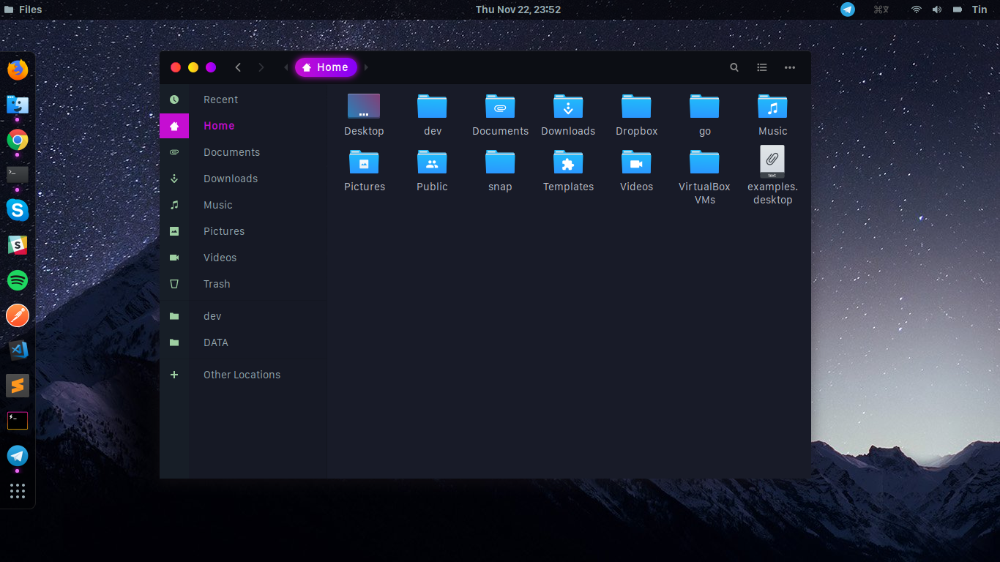
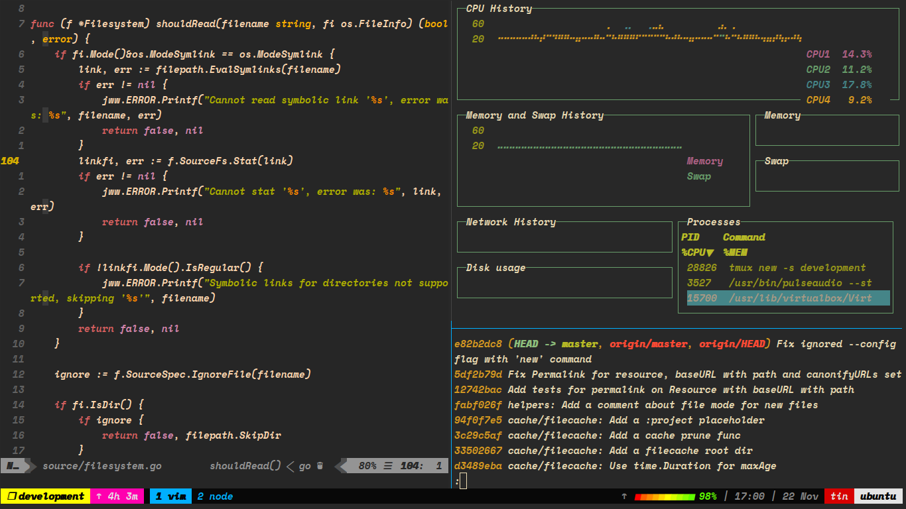
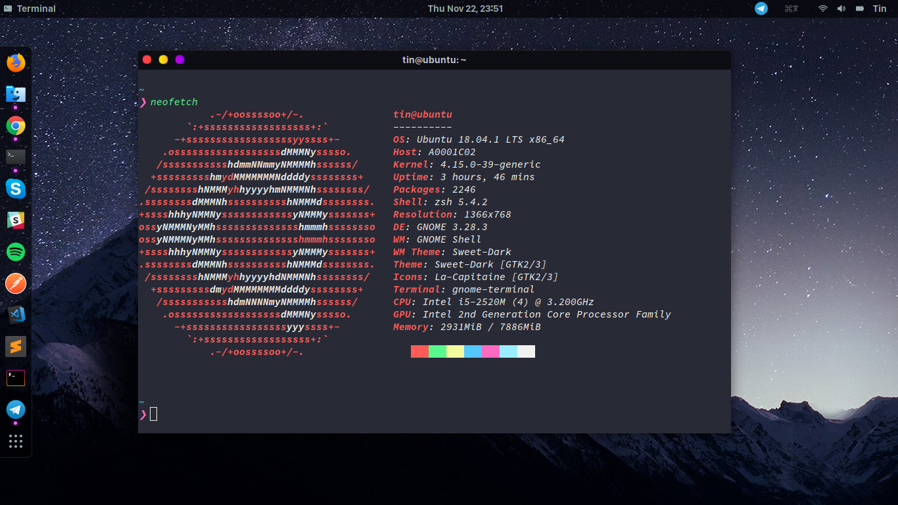

 

 

 


# My Linux Desktop - Ubuntu and Arch Linux

> A collection of awesome themes and icons that I use on my Gnome Destop, run on Ubuntu and ArchLinux Operating System 

> Thank all opensourcers for their hard-working to build and push beautiful and pushed to [Gnome-Look website](https://www.gnome-look.org/) 

## Getting Started

[Install](install.sh) open `gnome-tweak-tool` and choose your favorite `themes` and `icons`. Enjoy!

*For the screenshot above, I use:*
- Application icons: `Sweet Dark`
- Cursor: `OSX-ELCap`
- Icons: `La-Captaine`
- Shell: `Sweet-Dark`

### Prerequisites

You need to have the `git`, `curl/wget` on your system first.  

### Installing

To install themes, icons and fonts, you can use the install script using cURL:

```sh
curl -o- https://raw.githubusercontent.com/NguyenTrungTin/gnome-desktop/master/install.sh | bash
```

Or Wget:

```sh
wget -qO- https://raw.githubusercontent.com/NguyenTrungTin/gnone-desktop/master/install.sh | bash
```

## Contributing

Please read [CONTRIBUTING.md](CONTRIBUTING.md) for details on our code of conduct, and the process for submitting pull requests to us.

## Authors

* **Tin Nguyen** - [NguyenTrungTin](https://github.com/NguyenTrungTin)

## Credits

*This project is inspired by awesome opensourcers who built themes, icons and fonts:*

- [Gnome-Look website](https://www.gnome-look.org/)
- [Sweet Theme](https://github.com/EliverLara/Sweet)
- [OSX EL Capitan icon](https://www.opendesktop.org/p/1084939/)
- [La Capitaine icon](https://github.com/keeferrourke/la-capitaine-icon-theme)
- And many more... Please checkout [Gnome-Look website](https://www.gnome-look.org/) 

## License

This project is licensed under the [MIT](LICENSE.md) License.

